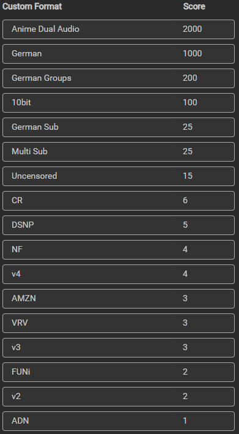
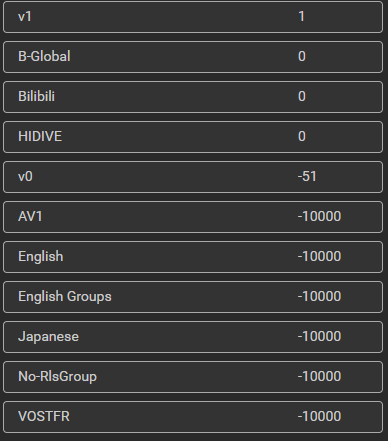
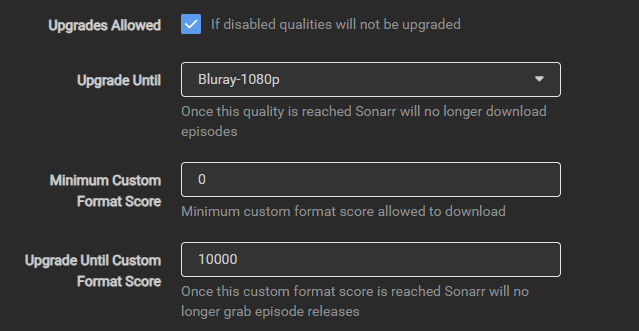
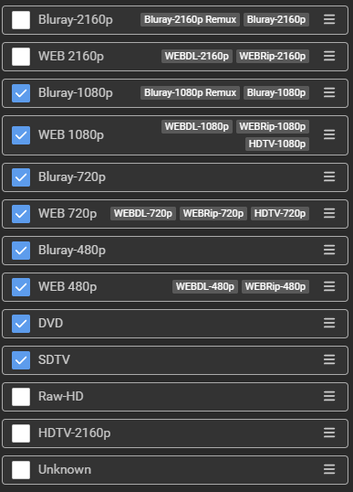

# I AM USING THE CUSTOM FORMATS FROM [TRASH GUIDES](https://trash-guides.info/). HOWEVER, I HAVE CUSTOMIZED SOME SETTINGS.

*[CF's](<custom format>) not found here are from [Trash Guides](https://trash-guides.info/Sonarr/sonarr-collection-of-custom-formats/), except for the German Dual Audio CF, which can be found [here](https://github.com/PCJones/radarr-sonarr-german-dual-language).*

*My settings are configured for dual German/Japanese or German/Chinese audio.
If no dual audio is available, only German audio will be searched for. If no German audio is found, the original dubbing will be used with multiple or German subtitles only.*

Custom Format Score:

Quality Profile Settings:

